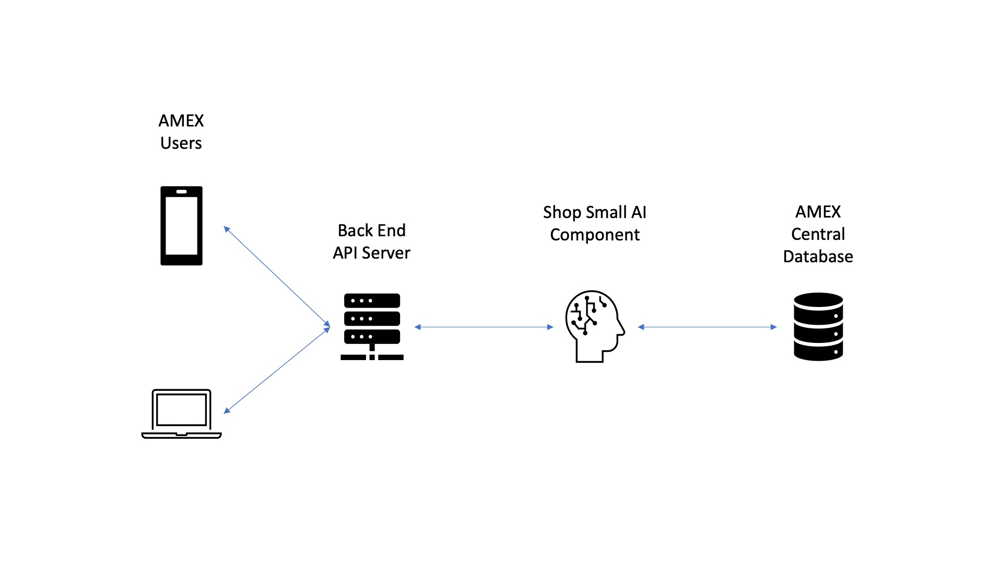
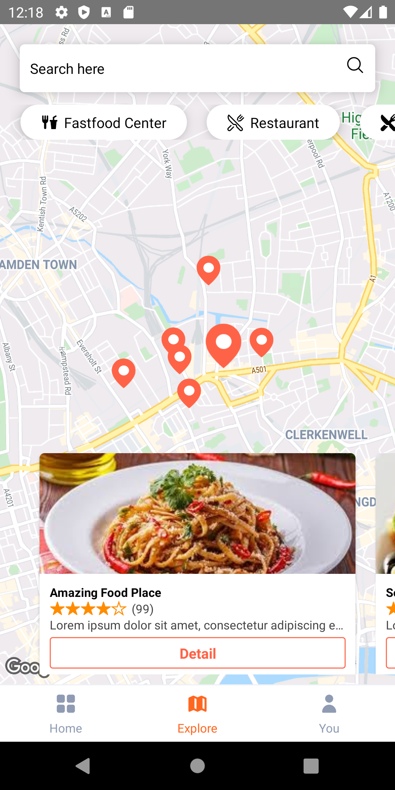
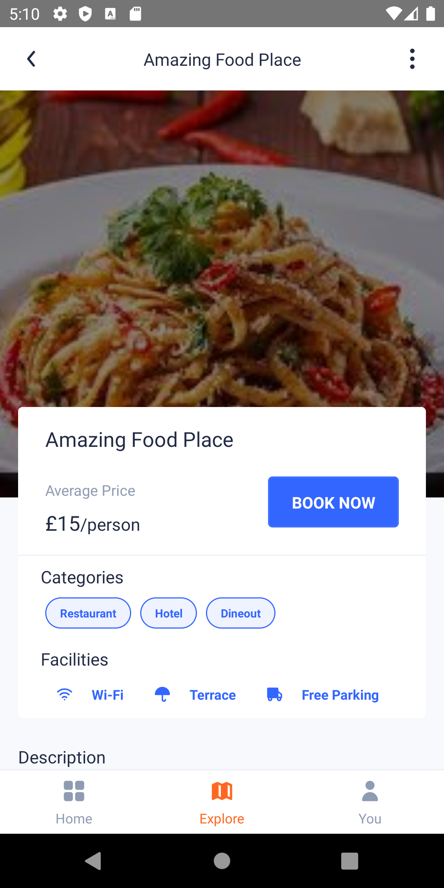
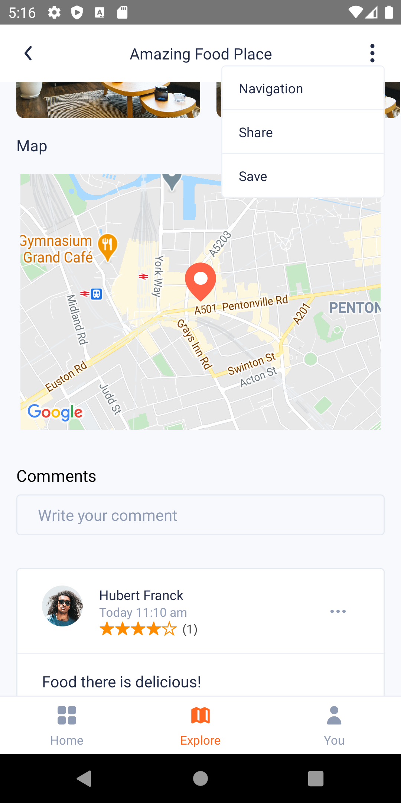

# AMEX Shop-Small App
The mobile app in react native for implement the personalized recommendation feed. 
This is the proof of concept how the recommendation works

## Content
* [Demo](#Demo)
* [Aim and pain points](#Aim-and-pain-points)
* [Proposed solution](#Proposed-solution)
    * [Recommendation System](#Recommendation-system)
    * [React Native mobile app example](#React-Native-mobile-app-example)
    * [Other infrastructures in the future](#Other-infrastructures-in-the-future)
* [Conclusion](#Conclusion)

## Demo
### Recommendation System
You should have Jupyter notebook installed. 
Go to recommendation dir and open Jupyter notebook:
```
cd recommendation
jupyter notebook
```

Run the code in Data Preperations.ipynb to generate random data. 
You should get two new files, "list_items.csv" and "user_rating.csv" respectively in the same dir.
Run the code in AMEX-Recommendation.ipynb to create neural network model, predict user preferences and get recommendation list.


### Mobile App
You should have **Android Studio** installed on your device and `yarn` available on your running environment
For android studio, proper SDK should installed, instruction [here](https://reactnative.dev/docs/environment-setup)

Run following commands:
```shell
yarn start
yarn android
```

## Aim and pain points
For the purpose of this work, we have delved
                      into the comments and surprisingly found that nearly
                      70% of the negative feedback refers to poor customer
                      service and no personalization
                      (i.e., being AMEX a multinational firm and with a large
                      customer base, hence not dedicating enough time to
                      improve user experiences).
                      Furthermore, problems between the users and
                      AMEX small businesses partners were also
                      encountered among the comments.
                      
The new solution consists of improving Amex
current mobile app by introducing hyperpersonalization, triggered by an AI-powered
recommendation system, that collects data
about each user’s purchase history and points redeemed in
the past, identifying the user’s consumption preferences and
spending capabilities. Then, the system automatically
orders the offers at a more personal level, categorised by
relevance to the users, presenting them according to their
specific real-time location, predicted preferences and
current financial status
## Proposed solution
An with-trained recommendation system would be implemented at the backend, 
this system will using the user token as the reference to securely access the 
transaction history of the user and analyze the user preferences based on the history
and produce the recommendation results on any internal API requests such as:
```json
    {
        "id": "1",
        "coordinate": {
            "latitude": 51.531164,
            "longitude": -0.120207,
        },
       "title": "Amazing Food Place",
        "description": "this is the description",
        "image": "images/1",
        "rating": 4,
        "reviews": 99,
        "categories": ["Restaurant", "Hotel", "Dineout"],
        "price": 15,
        "postcode": "N1 9JL",
        "phoneNumber": "07410332392"
    }
```

The system overview should as follow: 


### Recommendation system

Our recommendation system ensures the more tailored products will be recommended to the user, based on : 

* Ratings of other users who have the similar taste as the user 

* Geolocation of items 

* User’s spending capability 

Our recommendation system uses collaborative filtering, which is generally used in successful recommendation system nowadays. In simple term, the approach checks if a user has some similar preferences and dislikes of certain items with other user. If it does, then it assumes that the user will have similar opinion on other items with the other user. Through this approach, the system can predict the opinions of user on the items that user hasn’t bought.  

Given that we have the data of users, their ratings on the items they bought (rating depends on their ratings on feedback section or amount of purchases) and the geolocation of the items, our recommendation system will predict the preferences level of users on each of the items. 

We are using Pytorch to build the deep learning neural network model, which helps us infer the similarities of preferences between users and predict the preferences of all items for every users. The input of our existing data will be modified to replace strings with numbers, so it can be read easily by the neural network model. 

The output of the recommendation system is a list of items, where the items with higher user rating will come before the items with lower ratings. This list will be utilised in the recommendation section and search list of the app, where the items that user prefer the most will appear first. 

### React Native mobile app example

The React Native app is a demo of how a recommendation process works and a typical user interaction
with the system. 

A typical user will first access the **"Explore Page"** which has the recommended offers fed from central
backend server which runs the recommendation system. For example: The user at *Kings Cross Station* 
could receive several markers display on the map as follows


Once the user choose one of the shop-small partner's shop, they will be direct to the shop detail page 
which shows the description, location and current available offers. 


They can also share this with their friend, open the google map to navigate and make a booking via the platform (using telephone number now) as follows:


### Other infrastructures in the future
The current solution only includes *AI component* and *Mobile APP*, the server API should be implemented properly in terms of 
security. Also a robust connection between AI and central database should be designed and collect the proper data for AI to digest.

## Conclusion
The solution demonstrates the possibility to achieve the plans in the business proposal i.e. intelligent recommendation system
In the future, Two streams can be improved, specifically, improve the UI layout in the the standard AMEX UI and train the model to improve the accuracy.
